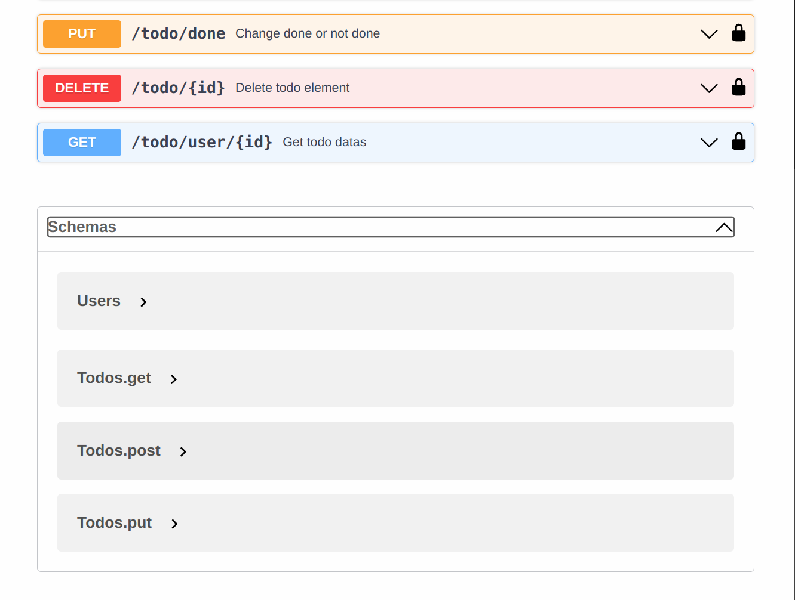

[Back](../README.md)
# Fiber
- [Fiber](https://gofiber.io/) is go web framework.
- User's password save by bcrypt.(limit maximum 72 bytes. if over 72 bytes, can not distinguish.)
- I itentionally do not use ORM. (This is small and one-man project, better to show my row sql code)
- Use jwt but not support refresh token. (default valid duration is 15 minutes)
- JWT compare jwt claims's login_id and request_user_id if it is different, respond 401.
  
*More detail refer code and comments.
  
# Swagger
- You can test api by Swagger yaml file through vscode or swaggereditor etc..
- If you want to test api, you have to use vscode with localhost or swaggereditor with your own domain.

